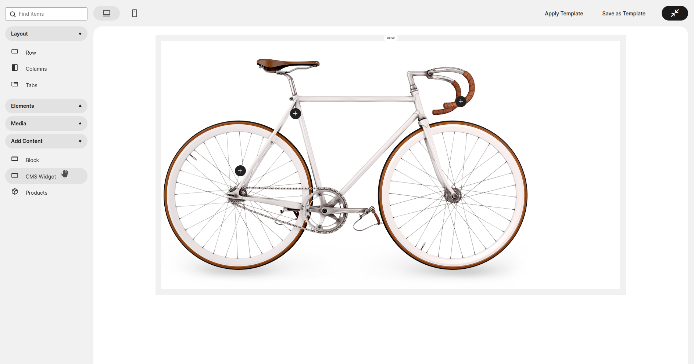
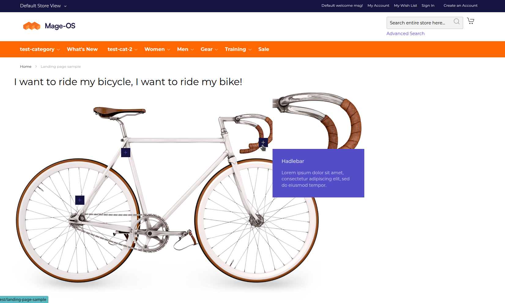
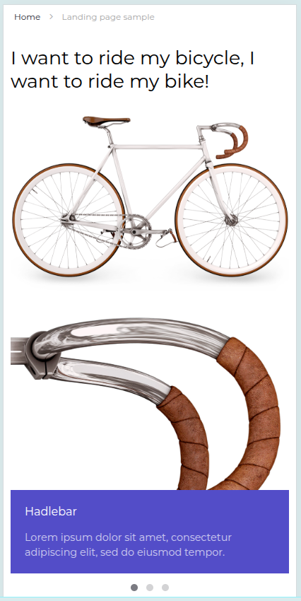

# Dadolun MarkersWidget

## This module is for test purpose only, don't use on production!

This is a demonstration test for all the mage-os stuff realized until today ( July 21 2025 ) for frontend enhancement:
- Pagebuilder import/export template module: https://github.com/mage-os-lab/module-pagebuilder-template-import-export
- Pagebuilder widget preview module: https://github.com/mage-os-lab/module-page-builder-widget
- UIkit3 theme base module: https://github.com/mage-os-lab/module-theme-uikit
- UIKit3 theme: https://github.com/mage-os-lab/theme-frontend-uikit

Component tested: https://demo.yootheme.com/joomla/widgetkit/uikit/home/popover#popover

Adminhtml preview:

Desktop frontend result:

Mobile frontend result:

### Actual problems and future improvements:

In order to apply UIkit3 styles to widget preview shadowDOM was used.
This cause problems with pagebuilder preview on "mobile" and on template preview saving.
A new development is open to create custom widgets for UIkit3 Theme, for sure a dedicated uikit.css with magento pagebuilder selectors in replacement to media queries can be a way.
